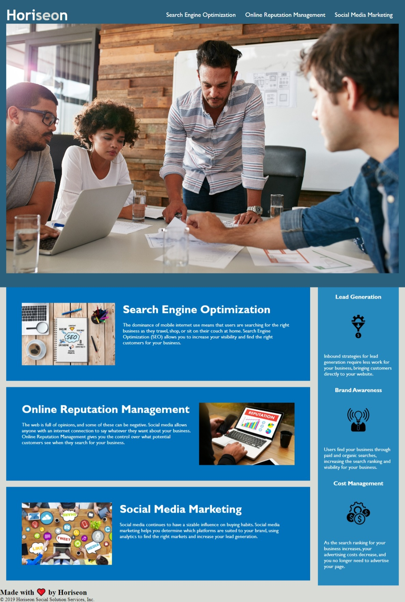

# Module1-Challenge

## Description

To refractor an existing webpage and follows accesibilty standards so the site has optimized search engines

## Usage




```
<...HTML CHANGES...>

Descriptive comments added

<!-- header and navigation -->

<!-- hero -->

<!-- main content -->

<!-- seo section -->

<!-- online reputation section -->

<!-- social media marketing section -->

<!-- Additional secondary content -->

<!-- benefits section -->

<!-- Page footer -->


Changed title to "Digital Solutions"

Changed <div>  for <header> tag

Changed <div>  for <nav> tag in HTML

Changed <div> for <section> tag in HTML and id for class

Changed <div> for <figure> tag in html to identify main photo

Added <main> tag to group the main content

Added <footer> tag at the bottom of the page

Added <image alt> tag to each image to describe photo

The benefits <div> tag was changed to <aside> tag


<...CSS CHANGES...>

Descriptive comments added

/* Sizing, padding and margins */

/* header*/

/* Navigation bar */

/* Main content */

/* Benefits Section */

/* Page Footer */

Changed <div>  for <nav> tag in .header nav 

Consolidated and organized properties so that elements that have same properties are grouped together
  ```
# Installation
 
  The project was uploaded to GitHub at the following repository:  https://github.com/Mrose332/Module1-Challenge.git

  You can access the deployed application with the GitHub Pages link: https://mrose332.github.io/Module1-Challenge/
